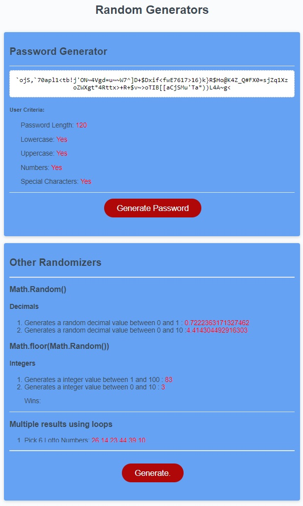

# Random Password Generator

In this page you will find a random password generator that will prompt you wich characters you want to use and then create a password based on that criteria.

Additionaly you will also see different methods of creating random numbers using the Math.random() and Math.floor() methods.

### Webpage Link
MISSING

### GitHub Repo
https://github.com/arlindo2017/password-generator)

### Webpage Picture

## Skills on display
- 
